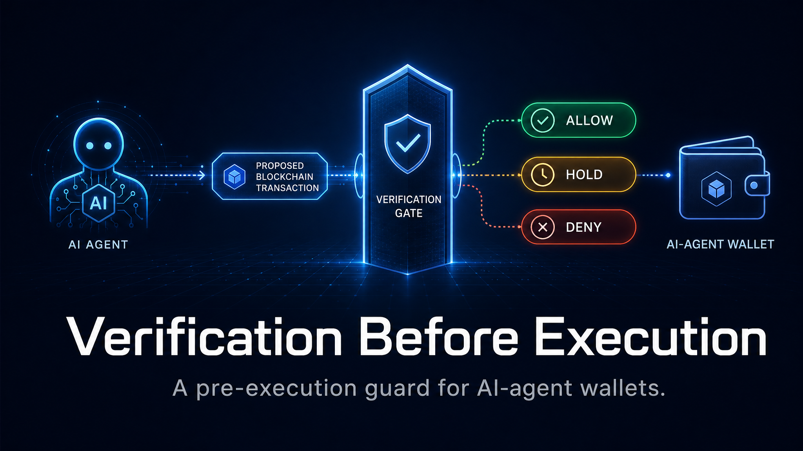

# VaultProof Agent Guard



> Your agent can think freely. It can't spend freely.

> ⚠️ **ALPHA / EXPERIMENTAL — reference implementation.**
> This is an open-source **reference implementation** demonstrating how
> *Verification Before Execution* can guard AI-agent wallet actions before
> signing. It is **not** audited, **not** certified, and **not** intended for
> production custody or use with real funds. You are responsible for
> configuration, testing, key management, and regulatory compliance. See
> [THREAT_MODEL.md](./THREAT_MODEL.md) and [SECURITY.md](./SECURITY.md).

Non-custodial, pre-execution wallet guard for AI agents. Before your agent
signs **anything**, the transaction hits a verification gate: spend caps,
allowlists, drain-vector blocking, and a Telegram ping for anything unusual —
**ALLOW / HOLD / DENY**, with a ProofRecord either way.

Built by [Remnant Fieldworks Inc.](https://remnantfieldworks.com) on the
[ExecutionProof](https://executionproof.io) gate. Verification Before Execution™.

[](https://zenodo.org/badge/latestdoi/1302101336)
[](https://github.com/derekhone/vaultproof-agent-guard/actions/workflows/test.yml)

## Try It Now (60 seconds)

See real ALLOW / HOLD / DENY decisions in action:

```bash
git clone https://github.com/derekhone/vaultproof-agent-guard.git
cd vaultproof-agent-guard
npm ci
npm test
```

**You'll see 12/12 tests pass** — covering spend caps, allowlists, drain-vector blocking (setApprovalForAll, unlimited approvals), parameter mutation, stale approvals, replay, and fail-closed. The captured output is committed in [BENCHMARK.md](./BENCHMARK.md) so you can compare.

No API keys, no Telegram setup required for the tests. Just clone, install, run.

## Why

The #1 unsolved problem for AI agents with wallets is: **how do I stop my
agent from draining itself?** Prompt injection, hallucinated destinations,
unlimited approvals, `setApprovalForAll` to unknown contracts — one bad
decision and the wallet is gone.

VaultProof Agent Guard is a policy gate that sits *in front of your signer*:

- **Spend caps** — per-transaction and daily USD ceilings
- **Allowlist-only** — approved contracts and addresses, everything else DENIED
- **Drain-vector blocking** — unlimited approvals and `setApprovalForAll` blocked by default
- **Human HOLD approval** — borderline transactions ping you on Telegram; no reply in 5 minutes = DENY
- **Fail-closed** — if the gate is unreachable, nothing signs. Ever.
- **Non-custodial** — we never hold your keys

## Installation

```bash
npm install vaultproof-agent-guard
```

Or clone and build from source:

```bash
git clone https://github.com/derekhone/vaultproof-agent-guard.git
cd vaultproof-agent-guard
npm install
npm run build
```

## Setup

### 1. Configure Environment (Optional — for Telegram HOLD approvals)

If you want human approval via Telegram for HOLD decisions:

```bash
cp .env.example .env
```

Edit `.env` and add:

- **`TELEGRAM_BOT_TOKEN`**: Get from [@BotFather](https://t.me/BotFather) on Telegram
- **`TELEGRAM_CHAT_ID`**: Message your bot, then visit `https://api.telegram.org/bot<YOUR_BOT_TOKEN>/getUpdates` to get your chat ID

### 2. Choose or Customize a Boundary Profile

Three profiles are included in `profiles/`:

- **`conservative-trader.json`**: Low caps ($100/tx, $250/day), strict allowlist
- **`defi-yield.json`**: Moderate caps ($5k/tx, $15k/day), 50% hold threshold
- **`nft-ops.json`**: NFT-specific ($250/tx, $1k/day), 80% hold threshold

Or create your own `BoundaryProfile` JSON — see existing profiles for the schema.

## Quickstart

```ts
import { VaultProofGuard } from "vaultproof-agent-guard";
import { askTelegram } from "vaultproof-agent-guard/telegram";
import profile from "./profiles/conservative-trader.json";

const guard = new VaultProofGuard({
  agentId: "trading-agent-01",
  profile,
  localOnly: true, // free tier — local rules, unsigned records
  onHold: async (tx, holdId) =>
    askTelegram(`${tx.action} — $${tx.amountUsd ?? 0} → ${tx.to} (${holdId})`),
});

const result = await guard.verify({
  action: "token_transfer",
  to: "0x...allowlisted".toLowerCase(),
  amountUsd: 85,
  chain: "base-mainnet",
});

if (result.decision !== "ALLOW") throw new Error(result.reason);
// proceed to sign & send


### Running the Example

Try the included example that demonstrates integration with an agent toolkit:

```bash
# Make sure you've set up .env with Telegram credentials first
npm run example
```

The example (`examples/agentkit-transfer.ts`) shows a realistic transfer flow with HOLD approval.

## API Reference

### `VaultProofGuard`

**Constructor:**
```ts
new VaultProofGuard(config: GuardConfig)
```

**GuardConfig:**
- `agentId: string` — unique identifier for your agent
- `profile: BoundaryProfile` — spend caps and policy rules
- `localOnly?: boolean` — `true` for free tier (local-only, no hosted gate or signed records)
- `onHold?: (tx: ProposedTx, holdId: string) => Promise<boolean>` — callback for HOLD decisions; return `true` to approve, `false` to deny
- `apiKey?: string` — for paid hosted gate (provides signed ProofRecords)
- `apiUrl?: string` — custom gate URL (defaults to ExecutionProof hosted gate)

**Methods:**
- `verify(tx: ProposedTx): Promise<VerifyResult>` — check a transaction before signing

**VerifyResult:**
- `decision: "ALLOW" | "HOLD" | "DENY"`
- `reason: string` — explanation
- `proofRecordId: string` — unique ID for this verification
- `holdId?: string` — if HOLD decision

### `BoundaryProfile`

JSON schema:
```json
{
  "name": "profile-name",
  "perTxMaxUsd": 100,
  "dailyMaxUsd": 250,
  "allowlist": ["0xaddress1", "0xaddress2"],
  "blockUnlimitedApprovals": true,
  "blockSetApprovalForAll": true,
  "holdThresholdPct": 75
}
```

- **`perTxMaxUsd`**: Maximum USD per transaction
- **`dailyMaxUsd`**: Maximum total USD per 24-hour rolling window
- **`allowlist`**: Array of lowercase addresses (empty = deny all)
- **`blockUnlimitedApprovals`**: Block `approve(spender, type(uint256).max)` calls
- **`blockSetApprovalForAll`**: Block `setApprovalForAll(operator, true)` calls
- **`holdThresholdPct`**: Trigger HOLD if transaction exceeds this % of `perTxMaxUsd`

### `askTelegram`

```ts
import { askTelegram } from "vaultproof-agent-guard/telegram";

await askTelegram(message: string): Promise<boolean>
```

Sends a Telegram message with Approve/Deny buttons. Returns `true` if approved within 5 minutes, `false` otherwise.

**Environment variables required:**
- `TELEGRAM_BOT_TOKEN`
- `TELEGRAM_CHAT_ID`

## Decision Flow

```
ProposedTx → VaultProofGuard.verify()
  ↓
  1. Check local hard rules (caps, allowlist, drain vectors)
     ├─ DENY → return immediately
     └─ Continue
  ↓
  2. Check hosted gate (if apiKey provided)
     └─ Risk signals from ExecutionProof
  ↓
  3. HOLD threshold exceeded?
     ├─ Yes → onHold callback (e.g., Telegram approval)
     │   ├─ Approved → ALLOW
     │   └─ Denied/Timeout → DENY
     └─ No → ALLOW
  ↓
  Return { decision, reason, proofRecordId, holdId? }
```

## Verifying it works

This project ships a reproducible test suite that runs the **real guard** against
a battery of drain-attack shapes (unlimited approval, `setApprovalForAll`,
non-allowlisted destinations, over-cap transfers, daily-cap accumulation, HOLD
approval/denial, and fail-closed behaviour).

```bash
npm install
npm test        # exits non-zero if any case fails (gates CI)
```

The verbatim, captured output is in [BENCHMARK.md](./BENCHMARK.md). It is real
tool output, not hand-written — re-run it yourself to confirm. For what the suite
does **not** prove, read [THREAT_MODEL.md](./THREAT_MODEL.md).

## Free (local) vs. hosted (Pro) — records are different

This open-source package is the **free, local tier**. Be precise about what that
means, because the two tiers produce different kinds of records:

| | **Local / free (this repo)** | **Hosted / Pro (not in this repo)** |
| --- | --- | --- |
| Policy logic | ✅ full ALLOW/HOLD/DENY ([`src/policy.ts`](./src/policy.ts)) | same logic, server-side |
| ProofRecord | **local id only, _unsigned_** | cryptographically signed, independently verifiable |
| Runs offline | ✅ | ❌ (calls hosted gate) |
| Independent audit trail | ❌ | ✅ |

> The local tier's `proofRecordId` is a convenience identifier with **no
> cryptographic signature**. Do not present local records as tamper-evident or
> independently verifiable — signed ProofRecords are a hosted-tier capability and
> are **not** part of this release.

## License & Trademarks

Code is licensed **MIT** — see [LICENSE](./LICENSE). The MIT license covers the
source code in this repository only.

It does **not** grant rights to Remnant Fieldworks Inc. trademarks, the hosted
ExecutionProof platform/backend, the RF-100 standard, or any patents. **ExecutionProof™**,
**VaultProof™**, **ProofRecord™**, and **Verification Before Execution™** are
marks of Remnant Fieldworks Inc., used here to describe the project's origin and
are not licensed for other use.

## Contributing

Issues and PRs welcome. For major changes, open an issue first. Security reports
should follow [SECURITY.md](./SECURITY.md) (please do not file public issues for
vulnerabilities).

Built by [Remnant Fieldworks Inc.](https://remnantfieldworks.com) • Powered by [ExecutionProof](https://executionproof.io)
